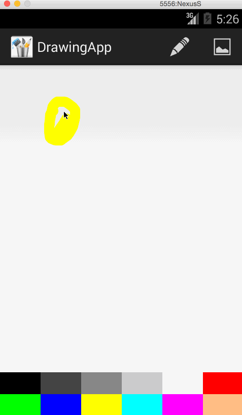

DrawingApp
==========

This is an Android demo application for simple drawing. 

Time spent: 3 hours spent in total

Completed user stories:

 * [x] Required: User can press down to draw on the canvas.
 * [x] Required: User can choose between at least 6 colors to draw with.
 * [x] Required: User can choose between at least 3 different brush sizes.
 * [x] Required: User can press "New" to clear the canvas and start over.
 
Notes:

It would have been cool to save the drawing to disc and allow users to load it back up and continue drawing.
Also it would have been cool to pass in the currently selected brush color to the brush size picker and color the buttons. 
And finally, I would want to highlight the currently selected brush size to give feedback on the size picker. 

Walkthrough of all user stories:

